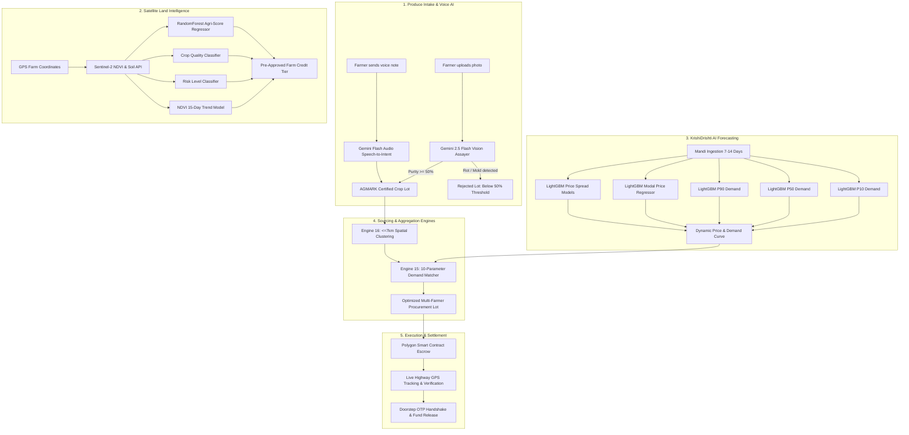

# AgriChain Machine Learning & Artificial Intelligence Architecture Specification

## Executive Summary

The **AgriChain** ecosystem integrates **14 Machine Learning & Deep Learning models** along with **2 dedicated Spatial Combinatorial Optimization engines**. These systems cover the entire agricultural supply chain lifecycle: from **multimodal visual produce inspection** and **rural dialect voice note parsing**, to **probabilistic time-series mandi demand forecasting**, **Sentinel-2 satellite credit scoring**, and **multi-objective logistics routing**.

---

## 1. Master Machine Learning & AI Matrix

| # | Model Name | Category | Algorithm / Architecture | Artifact / Code Location | Target Purpose | Primary UI / Integration |
|---|---|---|---|---|---|---|
| **1** | **Gemini Produce Assayer** | Multimodal Vision | Google Gemini 2.5 Flash Multimodal Vision | [`gemini_crop_assay_service.dart`](file:///c:/Users/adity/Downloads/New%20folder%20%2810%29/agrichain/geetauni-main/agrichain/lib/services/gemini_crop_assay_service.dart) | Produce authenticity, AGMARK grading, fungal rot & mold detection, purity score | Farmer App &rarr; [`add_crop_screen.dart`](file:///c:/Users/adity/Downloads/New%20folder%20%2810%29/agrichain/geetauni-main/agrichain/lib/screens/farmer/add_crop_screen.dart) |
| **2** | **WhatsApp Vision Quality & Disease Assayer** | Multimodal Vision | Google Gemini 2.5 Flash Vision | [`server.js:L542`](file:///c:/Users/adity/Downloads/New%20folder%20%2810%29/agrichain/geetauni-main/whatsapp_cloud_api/server.js#L542) | Mobile WhatsApp photo inspection, disease diagnosis, organic remedies | WhatsApp Kisan AI Bot (`/webhook`) |
| **3** | **Offline Native Chrominance Assayer** | Computer Vision | HSV/RGB Color Spectrum & Entropy Analysis | [`crop_image_validator_service.dart`](file:///c:/Users/adity/Downloads/New%20folder%20%2810%29/agrichain/geetauni-main/agrichain/lib/services/crop_image_validator_service.dart) | Offline produce validation, non-produce filtering, necrosis detection | On-device offline fallback |
| **4** | **P10 Conservative Demand Model** | Probabilistic Forecasting | LightGBM Quantile Regressor (`alpha=0.10`) | [`agritech_forecast_pipeline.joblib`](file:///c:/Users/adity/Downloads/New%20folder%20%2810%29/agrichain/score/no/ml/models/agritech_forecast_pipeline.joblib) | 10th percentile conservative lower bound demand forecast (kg) | Farmer App &rarr; [`demand_forecasting_screen.dart`](file:///c:/Users/adity/Downloads/New%20folder%20%2810%29/agrichain/geetauni-main/agrichain/lib/screens/farmer/demand_forecasting_screen.dart) |
| **5** | **P50 Expected Demand Model** | Probabilistic Forecasting | LightGBM Quantile Regressor (`alpha=0.50`) | [`agritech_forecast_pipeline.joblib`](file:///c:/Users/adity/Downloads/New%20folder%20%2810%29/agrichain/score/no/ml/models/agritech_forecast_pipeline.joblib) | 50th percentile median expected mandi demand volume (kg) | Farmer App &rarr; [`demand_forecasting_screen.dart`](file:///c:/Users/adity/Downloads/New%20folder%20%2810%29/agrichain/geetauni-main/agrichain/lib/screens/farmer/demand_forecasting_screen.dart) |
| **6** | **P90 Peak Demand Model** | Probabilistic Forecasting | LightGBM Quantile Regressor (`alpha=0.90`) | [`agritech_forecast_pipeline.joblib`](file:///c:/Users/adity/Downloads/New%20folder%20%2810%29/agrichain/score/no/ml/models/agritech_forecast_pipeline.joblib) | 90th percentile peak upside demand scenario (kg) | Farmer App &rarr; [`demand_forecasting_screen.dart`](file:///c:/Users/adity/Downloads/New%20folder%20%2810%29/agrichain/geetauni-main/agrichain/lib/screens/farmer/demand_forecasting_screen.dart) |
| **7** | **Mandi Modal Price Regressor** | Time-Series Regression | LightGBM Regressor (RMSE objective) | [`agritech_forecast_pipeline.joblib`](file:///c:/Users/adity/Downloads/New%20folder%20%2810%29/agrichain/score/no/ml/models/agritech_forecast_pipeline.joblib) | Forecast expected modal clearing price (₹/kg) across corridors | FastAPI `/api/forecast` & UI graphs |
| **8** | **Price Volatility Spread Regressors** | Volatility Modeling | Dual LightGBM Spread Models (Min/Max) | [`agritech_forecast_pipeline.joblib`](file:///c:/Users/adity/Downloads/New%20folder%20%2810%29/agrichain/score/no/ml/models/agritech_forecast_pipeline.joblib) | Predict min/max price corridor volatility band | FastAPI `/api/forecast` |
| **9** | **Agri Trust Credit Score Regressor** | Credit Underwriting | Scikit-Learn `RandomForestRegressor` | [`agri_score_model.joblib`](file:///c:/Users/adity/Downloads/New%20folder%20%2810%29/agrichain/score/no/ml/models/agri_score_model.joblib) (19 MB) | Predict credit score (0–100) using satellite NDVI & agronomic variables | Farmer App &rarr; [`land_analysis_screen.dart`](file:///c:/Users/adity/Downloads/New%20folder%20%2810%29/agrichain/geetauni-main/agrichain/lib/screens/farmer/land_analysis_screen.dart) |
| **10** | **Crop Quality Classifier** | Agronomic Classification | Scikit-Learn `RandomForestClassifier` | [`crop_quality_model.joblib`](file:///c:/Users/adity/Downloads/New%20folder%20%2810%29/agrichain/score/no/ml/models/crop_quality_model.joblib) (15.6 MB) | Predicts farm quality tier (`Excellent`, `Good`, `Moderate`, `Poor`) | Farmer App &rarr; [`land_analysis_screen.dart`](file:///c:/Users/adity/Downloads/New%20folder%20%2810%29/agrichain/geetauni-main/agrichain/lib/screens/farmer/land_analysis_screen.dart) |
| **11** | **Risk Level Classifier** | Risk Assessment | Scikit-Learn `RandomForestClassifier` | [`risk_level_model.joblib`](file:///c:/Users/adity/Downloads/New%20folder%20%2810%29/agrichain/score/no/ml/models/risk_level_model.joblib) (10.6 MB) | Classifies default risk (`Low`, `Medium`, `High`) for micro-loans | Credit Underwriting & Loans module |
| **12** | **15-Day NDVI Trend Classifier** | Remote Sensing ML | Scikit-Learn `RandomForestClassifier` | [`ndvi_trend_model.joblib`](file:///c:/Users/adity/Downloads/New%20folder%20%2810%29/agrichain/score/no/ml/models/ndvi_trend_model.joblib) (6.9 MB) | Forecasts 15-day vegetation trend (`Increase`, `Stable`, `Decrease`) | Land Analysis & crop health monitoring |
| **13** | **Rural Voice Speech-to-Intent Model** | Speech & Audio AI | Google Gemini 2.5 Flash Audio | [`server.js:L495`](file:///c:/Users/adity/Downloads/New%20folder%20%2810%29/agrichain/geetauni-main/whatsapp_cloud_api/server.js#L495) | Transcribes rural audio dialects (Hindi, Haryanvi, Punjabi, Marathi) & extracts structured trade intent | WhatsApp Kisan AI Voice Notes |
| **14** | **Multilingual Agronomic NLP Model** | Generative NLP | Google Gemini 2.5 Flash Multi-Model Pipeline | [`server.js:L702`](file:///c:/Users/adity/Downloads/New%20folder%20%2810%29/agrichain/geetauni-main/whatsapp_cloud_api/server.js#L702) | Context-aware multilingual reasoning for agronomic advice, market advisory, contracts | WhatsApp Kisan AI Bot Conversational Dialogue |
| **15** | **10-Parameter Demand Matching Engine** | Combinatorial Optimization | Multi-Objective Lot Aggregation & Knapsack | [`intelligent_matching_engine.dart`](file:///c:/Users/adity/Downloads/New%20folder%20%2810%29/agrichain/geetauni-main/agrichain/lib/services/intelligent_matching_engine.dart) | Aggregates fragmented smallholder lots to fulfill large corporate contracts | Bulk Buyer &rarr; [`dynamic_demand_matcher_screen.dart`](file:///c:/Users/adity/Downloads/New%20folder%20%2810%29/agrichain/geetauni-main/agrichain/lib/screens/bulk_buyer/dynamic_demand_matcher_screen.dart) |
| **16** | **Spatial Pooling & Route Clustering Engine** | Spatial Geometry & Graph Theory | Radius-Constrained Spatial Clustering & TSP | [`farmer_clustering_service.dart`](file:///c:/Users/adity/Downloads/New%20folder%20%2810%29/agrichain/geetauni-main/agrichain/lib/services/farmer_clustering_service.dart) & [`multi_fpo_cluster_service.dart`](file:///c:/Users/adity/Downloads/New%20folder%20%2810%29/agrichain/geetauni-main/agrichain/lib/services/multi_fpo_cluster_service.dart) | Groups farmers & FPOs within $\le 7.0\text{ km}$ radius with route optimization | Retail Buyer [`group_buying_screen.dart`](file:///c:/Users/adity/Downloads/New%20folder%20%2810%29/agrichain/geetauni-main/agrichain/lib/screens/retail_buyer/group_buying_screen.dart) & Bulk Buyer [`bulk_buyer_supply_screen.dart`](file:///c:/Users/adity/Downloads/New%20folder%20%2810%29/agrichain/geetauni-main/agrichain/lib/screens/bulk_buyer/bulk_buyer_supply_screen.dart) |

---

## 2. Deep-Dive by Domain

### Domain 1: Multimodal Computer Vision & Produce Assaying

#### Model 1: Google Gemini 2.5 Flash Multimodal Vision Produce Assayer
- **Source File**: [`gemini_crop_assay_service.dart`](file:///c:/Users/adity/Downloads/New%20folder%20%2810%29/agrichain/geetauni-main/agrichain/lib/services/gemini_crop_assay_service.dart)
- **API Endpoint**: `https://generativelanguage.googleapis.com/v1beta/models/gemini-2.5-flash:generateContent`
- **Inputs**: Raw image bytes (Base64 JPEG/PNG) of harvested crop produce.
- **Outputs (Structured JSON Schema)**:
  - `is_valid_produce` (boolean): Filters out non-agricultural images (selfies, vehicles, documents).
  - `crop_type` & `variety`: Categorizes crop (e.g. `Potato` &rarr; `Kufri Chipsona 50mm+`, `Wheat` &rarr; `Sharbati`).
  - `agmark_grade`: Official Indian grading tier (`AGMARK Grade A`, `Grade 1`, `Sub-Standard`).
  - `purity_score`: Continuous metric (0.0% – 100.0%).
  - `has_rot_or_spoilage`: Boolean flag. If fungal rot, mycelium, or necrotic decay is present, purity is strictly capped $<50\%$ and marked non-compliant.
  - `moisture_percentage`, `defect_percentage`, `foreign_matter_percentage`.
  - `suggested_price_premium_percent` & `storage_recommendation`.
- **Where It Is Used**:
  - In [add_crop_screen.dart](file:///c:/Users/adity/Downloads/New%20folder%20%2810%29/agrichain/geetauni-main/agrichain/lib/screens/farmer/add_crop_screen.dart) when farmers take or upload produce photos.
  - Results gate listing creation: rotten or non-compliant lots cannot be listed on the marketplace.

#### Model 2: WhatsApp Visual Quality & Disease Assayer
- **Source File**: [`whatsapp_cloud_api/server.js:L542`](file:///c:/Users/adity/Downloads/New%20folder%20%2810%29/agrichain/geetauni-main/whatsapp_cloud_api/server.js#L542)
- **Engine**: Gemini 2.5 Flash Vision Multimodal
- **Inputs**: Photos sent by farmers via WhatsApp messages.
- **Outputs**:
  - `category`: `produce_quality_assay` vs. `crop_disease_advisory` vs. `non_crop`.
  - Disease identification (`diseaseNameHindi`) and remedies (`diseaseTreatmentHindi`).
  - Purity score, estimated moisture, luster & grain quality rating.
- **Where It Is Used**: Official WhatsApp Cloud API webhook for farmers without smart app access.

#### Model 3: Native Edge Chrominance & Entropy Computer Vision Model (Offline Fallback)
- **Source File**: [`crop_image_validator_service.dart`](file:///c:/Users/adity/Downloads/New%20folder%20%2810%29/agrichain/geetauni-main/agrichain/lib/services/crop_image_validator_service.dart)
- **Engine**: Native Flutter `dart:ui` pixel-level colorimetric analyzer.
- **Methodology**: Decodes uncompressed bitmap pixels, analyzes color histograms across HSV/RGB channels, calculates spatial variance, green/golden chlorophyll index, and dark necrosis thresholds.
- **Where It Is Used**: Zero-latency, on-device offline backup when internet connectivity is intermittent.

---

### Domain 2: Probabilistic Demand & Mandi Price Forecasting (KrishiDrishti AI)

The forecasting engine lives in `score/no/ml/forecasting/` and is served via FastAPI (`/api/forecast`).

#### Models 4, 5, 6: LightGBM Quantile Regressors for Demand
- **Model Artifact**: [`agritech_forecast_pipeline.joblib`](file:///c:/Users/adity/Downloads/New%20folder%20%2810%29/agrichain/score/no/ml/models/agritech_forecast_pipeline.joblib) (3.5 MB)
- **Code**: [`train.py`](file:///c:/Users/adity/Downloads/New%20folder%20%2810%29/agrichain/score/no/ml/forecasting/train.py), [`inference.py`](file:///c:/Users/adity/Downloads/New%20folder%20%2810%29/agrichain/score/no/ml/forecasting/inference.py)
- **Architecture**:
  - **P10 Model**: `LGBMRegressor(objective="quantile", alpha=0.10, n_estimators=250, learning_rate=0.05)`
  - **P50 Model**: `LGBMRegressor(objective="quantile", alpha=0.50, n_estimators=250, learning_rate=0.05)`
  - **P90 Model**: `LGBMRegressor(objective="quantile", alpha=0.90, n_estimators=250, learning_rate=0.05)`
- **Input Features**:
  - 7-day, 14-day, 30-day lagged arrival quantities.
  - Rolling mean, rolling standard deviation, and rolling min-max.
  - Day of week, day of month, seasonal trigonometric terms ($\sin(2\pi d / 365), \cos(2\pi d / 365)$).
  - Temperature, precipitation, and corridor distance vectors.
- **Outputs**: Probabilistic demand bounds (P10 conservative, P50 expected, P90 peak) in kilograms.
- **Where It Is Used**:
  - Farmer App &rarr; [`demand_forecasting_screen.dart`](file:///c:/Users/adity/Downloads/New%20folder%20%2810%29/agrichain/geetauni-main/agrichain/lib/screens/farmer/demand_forecasting_screen.dart).
  - WhatsApp Bot when farmers inquire about where to sell for peak demand.

#### Models 7 & 8: LightGBM Mandi Price & Volatility Spread Regressors
- **Architecture**:
  - `LGBMRegressor(objective="regression", metric="rmse", n_estimators=300, learning_rate=0.04)`
  - Dual Spread Models: `price_min_spread_model` and `price_max_spread_model` (`n_estimators=100`).
- **Outputs**:
  - `expected_modal_price`: Expected market clearing price (₹/kg).
  - `min_price` & `max_price`: Volatility confidence interval.
- **Where It Is Used**: Displayed alongside demand curves in [demand_forecasting_screen.dart](file:///c:/Users/adity/Downloads/New%20folder%20%2810%29/agrichain/geetauni-main/agrichain/lib/screens/farmer/demand_forecasting_screen.dart).

---

### Domain 3: Satellite Land Intelligence & Credit Underwriting (Agri-Trust Score)

Trained on 5,000 ground-truth agricultural land parcels ([`agri_score_dataset_5000_rows_final.csv`](file:///c:/Users/adity/Downloads/New%20folder%20%2810%29/agrichain/score/no/ml/agri_score_dataset_5000_rows_final.csv)). Served via FastAPI (`/api/predict`) and consumed in Flutter by [`agri_score_service.dart`](file:///c:/Users/adity/Downloads/New%20folder%20%2810%29/agrichain/geetauni-main/agrichain/lib/services/agri_score_service.dart).

#### Model 9: Agri Trust Score Regressor
- **Artifact**: [`agri_score_model.joblib`](file:///c:/Users/adity/Downloads/New%20folder%20%2810%29/agrichain/score/no/ml/models/agri_score_model.joblib) (19.0 MB)
- **Algorithm**: Scikit-Learn `RandomForestRegressor(n_estimators=200, random_state=42)`
- **Input Vector (11 Features)**:
  - `state`, `district`, `crop_type`, `season`, `soil_type` (categorical with label encoding).
  - `land_area_hectares`, `rainfall_mm`, `avg_temperature_c`, `past_yield_ton_per_hectare`.
  - `ndvi_current`, `ndvi_30day_avg` (Sentinel-2 satellite imagery).
- **Output**: Continuous credit score from `0` to `100`.

#### Model 10: Crop Quality Classifier
- **Artifact**: [`crop_quality_model.joblib`](file:///c:/Users/adity/Downloads/New%20folder%20%2810%29/agrichain/score/no/ml/models/crop_quality_model.joblib) (15.6 MB)
- **Algorithm**: Scikit-Learn `RandomForestClassifier`
- **Output**: Multi-class classification: `Excellent`, `Good`, `Moderate`, or `Poor`.

#### Model 11: Risk Level Classifier
- **Artifact**: [`risk_level_model.joblib`](file:///c:/Users/adity/Downloads/New%20folder%20%2810%29/agrichain/score/no/ml/models/risk_level_model.joblib) (10.6 MB)
- **Algorithm**: Scikit-Learn `RandomForestClassifier`
- **Output**: Financial underwriting risk tier: `Low Risk`, `Medium Risk`, or `High Risk`.

#### Model 12: 15-Day NDVI Trend Predictor
- **Artifact**: [`ndvi_trend_model.joblib`](file:///c:/Users/adity/Downloads/New%20folder%20%2810%29/agrichain/score/no/ml/models/ndvi_trend_model.joblib) (6.9 MB)
- **Algorithm**: Scikit-Learn `RandomForestClassifier`
- **Output**: Vegetation trajectory: `Increase`, `Stable`, or `Decrease`.
- **Where Models 9–12 Are Used**:
  - Farmer App &rarr; [`land_analysis_screen.dart`](file:///c:/Users/adity/Downloads/New%20folder%20%2810%29/agrichain/geetauni-main/agrichain/lib/screens/farmer/land_analysis_screen.dart) for instant satellite parcel audit.
  - Credit Underwriting Module for pre-approved collateral-free institutional loans.

---

### Domain 4: Rural Speech Recognition & Conversational NLP

#### Model 13: Rural Audio Speech-to-Intent Model (Gemini Flash Audio)
- **Source File**: [`whatsapp_cloud_api/server.js:L495`](file:///c:/Users/adity/Downloads/New%20folder%20%2810%29/agrichain/geetauni-main/whatsapp_cloud_api/server.js#L495)
- **Engine**: Gemini 2.5 Flash Audio Model
- **Inputs**: Raw audio voice notes (audio/ogg, opus, mp3, m4a) recorded by farmers in rural dialects (Haryanvi, Bhojpuri, Punjabi, Marathi, rural Hindi).
- **Processing Logic**:
  - Direct speech-to-semantic understanding (no intermediate lossy STT step).
  - Intent classification: `listing`, `price_inquiry`, `demand_prediction`, `escrow_inquiry`, `agronomic_advisory`.
  - Regional unit normalization: Converts *bori* (50kg), *mann* (40kg), *katta* (50kg), *quintal* (100kg), and *ton* (1000kg) to standardized metric quintals.
- **Where It Is Used**: Official WhatsApp Cloud API voice interface.

#### Model 14: Multilingual Conversational NLP Engine
- **Source File**: [`whatsapp_cloud_api/server.js:L472-493`](file:///c:/Users/adity/Downloads/New%20folder%20%2810%29/agrichain/geetauni-main/whatsapp_cloud_api/server.js#L472-L493)
- **Engine**: Multi-model fallback (`gemini-2.5-flash-lite` &rarr; `gemini-flash-lite-latest` &rarr; `gemini-2.5-flash`).
- **Outputs**: Answers farmer agronomic inquiries, summarizes trade contracts, and provides pest remedies in conversational Hindi and English.

---

### Domain 5: Spatial Combinatorial Optimization Engines

#### Engine 15: 10-Parameter Intelligent Demand Matching Engine
- **Source File**: [`intelligent_matching_engine.dart`](file:///c:/Users/adity/Downloads/New%20folder%20%2810%29/agrichain/geetauni-main/agrichain/lib/services/intelligent_matching_engine.dart)
- **Algorithm**: Multi-Objective Knapsack & Fractional Lot Splitting with Penalty Functions.
- **Objective Function Optimization Criteria**:
  1. Price compatibility (Farmer reserve rate $\le$ Buyer ceiling price).
  2. AGMARK quality grade alignment.
  3. Hyperlocal road distance to delivery terminal.
  4. Harvest freshness and shelf-life buffer.
  5. Delivery transit feasibility window.
  6. Vehicle fleet sizing (Tata Ace 1.5T, LCV 407 4T, Medium Truck 9T, Multi-Axle 16T).
  7. Historical farmer fulfillment reliability score.
  8. Packaging standard compatibility (Jute / HDPE / Crates).
  9. Fractional lot allocation (split large batches without breaking farmer units).
  10. Green logistics route optimization & $\text{CO}_2$ emissions reduction.
- **Where It Is Used**: Bulk Buyer App &rarr; [`dynamic_demand_matcher_screen.dart`](file:///c:/Users/adity/Downloads/New%20folder%20%2810%29/agrichain/geetauni-main/agrichain/lib/screens/bulk_buyer/dynamic_demand_matcher_screen.dart).

#### Engine 16: Hyperlocal Spatial Clustering & Route Sequencing Engine
- **Source Files**: [`farmer_clustering_service.dart`](file:///c:/Users/adity/Downloads/New%20folder%20%2810%29/agrichain/geetauni-main/agrichain/lib/services/farmer_clustering_service.dart) & [`multi_fpo_cluster_service.dart`](file:///c:/Users/adity/Downloads/New%20folder%20%2810%29/agrichain/geetauni-main/agrichain/lib/services/multi_fpo_cluster_service.dart)
- **Algorithm**: Radius-constrained spatial clustering ($\le 7.0\text{ km}$ radius limit via Haversine formula) paired with Traveling Salesperson Problem (TSP) nearest-neighbor route sequencing.
- **Where It Is Used**:
  - Retail Buyer App &rarr; [`group_buying_screen.dart`](file:///c:/Users/adity/Downloads/New%20folder%20%2810%29/agrichain/geetauni-main/agrichain/lib/screens/retail_buyer/group_buying_screen.dart).
  - Bulk Buyer App &rarr; [`bulk_buyer_supply_screen.dart`](file:///c:/Users/adity/Downloads/New%20folder%20%2810%29/agrichain/geetauni-main/agrichain/lib/screens/bulk_buyer/bulk_buyer_supply_screen.dart).

---

## 3. End-to-End System Workflow



---

## 4. File Structure of AI/ML Assets

```
agrichain/
├── geetauni-main/
│   ├── agrichain/lib/services/
│   │   ├── gemini_crop_assay_service.dart      # Multimodal Vision Model (Gemini 2.5 Flash)
│   │   ├── crop_image_validator_service.dart   # Native Chrominance & Rot Detection Model
│   │   ├── demand_forecasting_service.dart     # KrishiDrishti Client & Fallback Engine
│   │   ├── agri_score_service.dart             # Satellite Credit Scoring Client
│   │   ├── score_engine.dart                   # Algorithmic Scoring Aggregator
│   │   ├── intelligent_matching_engine.dart    # 10-Parameter Demand Matcher
│   │   ├── farmer_clustering_service.dart      # 7km Radius Spatial Clustering
│   │   └── multi_fpo_cluster_service.dart      # Multi-FPO Cluster Engine
│   └── whatsapp_cloud_api/
│       └── server.js                           # Gemini Audio & Vision Webhook Handlers
└── score/
    └── no/
        ├── ml/
        │   ├── agri_score_dataset_5000_rows_final.csv  # 5,000-row Training Dataset
        │   ├── train_model.py                  # Training pipeline for Models 9, 10, 11, 12
        │   ├── evaluate_model.py               # Evaluation script
        │   ├── prediction_service.py           # Model inference loader
        │   ├── models/
        │   │   ├── agri_score_model.joblib     # 19.0 MB (Model 9)
        │   │   ├── crop_quality_model.joblib   # 15.6 MB (Model 10)
        │   │   ├── risk_level_model.joblib     # 10.6 MB (Model 11)
        │   │   ├── ndvi_trend_model.joblib     #  6.9 MB (Model 12)
        │   │   ├── agritech_forecast_pipeline.joblib # 3.5 MB (Models 4, 5, 6, 7, 8)
        │   │   ├── label_encoders.joblib       # Categorical encoders
        │   │   └── target_encoders.joblib      # Target encoders
        │   └── forecasting/
        │       ├── train.py                    # LightGBM Quantile & Price Training
        │       ├── inference.py                # P10/P50/P90 Inference Pipeline
        │       └── app.py                      # Standalone FastAPI Forecasting Server
        └── routers/
            ├── prediction.py                   # FastAPI /api/predict Router
            └── forecast_router.py              # FastAPI /api/forecast Router
```
